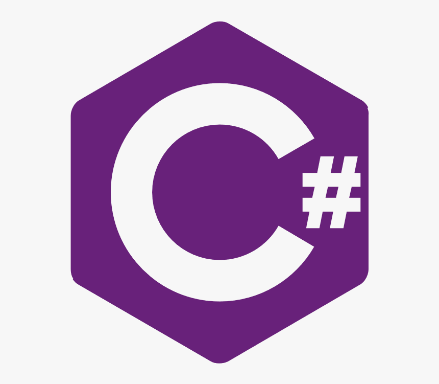

<html lang="en">
    <meta charset="UTF-8">
    <meta name="viewport" content="width=device-width, initial-scale=1.0">
    <title>cogingaze</title>
    
    <body style="background-color: Lavender;">  
<body>
    <h2> 
 Proqramlaşdırma dilləri 
 </h2>
    <ul>
        <li><a href="#section1">Ümumi Məlumatlar</a></li>
        <li><a href="#section2">Hansı proqramlaşdırma dilləri var?  </a></li>
        <li><a href="#section3"> Ən populyar proqramlaşdırma dilləri haqqında </a></li>
        <ol class="decimal-list">
            <li><a href="#section4">Python</a></li>
            <li><a href="#section5">Java</a></li>
            <li><a href="#section6">Javascript</a></li>
            <li><a href="#section7">C#</a></li>
            <li><a href="#section8">C/Cpp</a></li>
            <li><a href="#section9">Swift</a></li>
            <li><a href="#section10">Go</a></li>
            <li><a href="#section11">PHP</a></li>
            <li><a href="#section12">Ruby</a></li>
        </ol>   
    </ul>

    <section id="section1">
        <h3>Ümumi Məlumatlar</h3>
        
 
        Proqramlaşdırma dili kompüterin alqoritmi qəbul etməsi üçün istifadə edilir. 
        Proqramlaşdırma dili süni dil olub, təbii dillərdən məhdud sayda sözlərin olması ilə fərqlənirlər. Bu dillərlə hazır proqramlar 
        deyil, yalnız proqramın mətni yaradılır. Proqram dilini kompüterin başa düşdüyü maşın dilinə çevirmək üçün 
        translyatorlardan(translator–tərcüməçi) və kompilyatorlardan(compiler–tərtibatçı) istifadə edilir. Hər bir proqramlaşdırma 
        dilinin öz translyatoru(kompilyatoru) olur. Məsələ həll edərkən əvvəlcə yerinə yetiriləcək əməliyyatların alqoritmi tərtib 
        edilir, daha sonra bu əməliyyatlar hər-hansı alqoritm(proqramlaşdırma) dilində əmrlər şəklində yazılır. Tərtib olunmuş proqram 
        xüsusi əlavələr vasitəsilə yerinə yetirilir və ya maşın koduna çevrilir. 

        Proqramlaşdırma dili vasitəsilə hazır proqram yox, ancaq qurulmuş alqoritmi təsvir edən mətn yaradılır. Proqramçınınn başa 
        düşdüyü dildə olan bu proqram maşının başa düşdüyü dilə çevrilməlidir. Bunun üçün kompüterdə translyatorlar və kompilyatorlar 
        olur. 

        Proqram ancaq onların translyatorları olan halda icra oluna bilərlər. Translyatordan fərqli olaraq kompilyatorlar exe-faylların 
        yaradılması üçün istifadə olunur ki, onlar da sərbəst icra oluna bilərlər. Proqramlaşdırma dillərinin səviyyələri. Müxtəlif tip 
        prosessorlar müxtəlif tip əmrlər sisteminə malikdir. Əgər proqramlaşdırma dili konkret prosessor tipinə yönəlibsə və onun 
        xüsusiyyətlərini nəzərə alırsa, onda ona aşağı səviyyəli proqramlaşdırma dili deyirlər. Assembler aşağı səviyyəli 
        proqramlaşdırma dilidir. Çünki o, bir əmri mnemonika adlanan simvol işarəmələrinin köməyilə ədədlər şəklində yox, maşın kodları 
        şəklində verir. Assemblerin köməyilə çox səmərəli və kompakt proqramlar yaratmaq mümkündür. Assemblerdən adətən, sistem 
        əlavələrin, drayver-proqramların, kompüterin aparat resurslarına müraciət edən proqram modullarının hazırlanması üçün istifadə 
        olunur. Aşağı səviyyəli proqramlaşdırma dillərindən, adətən yüksəksəviyyəli peşəkar proqramçılar istifadə edir. Bu dillərdə 
        tutulan proqramlar yaddaşda az yer tutmaqla yanaşı, daha sürətlə icra olunurlar. Yüksəksəviyyəli proqramlaşdırma dilləri isə adi 
        dilə daha yaxın və insan üçün daha aydın başa düşüləndir. Çox yayılmış, bəzi proqramlaşdırma dilləri haqqında məlumat verək 

        Proqramlaşdırma dilləri iki hissəyə bölünür: 

        1)Aşağı səviyyəli dillər (Assembler, Avtokod və s.), 
        2)Yüksəksəviyyəli dillər (Fortran, Alqol, Kobol, Basic, Pascal, Ci və s.). 
        Aşağı səviyyəli proqramlaşdırma dillərində hər operatora bir maşın əmri uyğun gəlir. Bu dildə yazılan proqram az yer tutur və 
        tez yerinə yetirilir. Aşağı səviyyəli dillərdən sistem proqramçılar istifadə edir. Yuxarı səviyyəli proqramlaşdırma dillərində 
        hər operator bir neçə maşın əmri ilə əvəz edilə bilər, bu isə yaddaşda çox yer tutur. Yüksəksəviyyəli dillərdən isə tətbiqi 
        proqramçılar istifadə edir. 
        

        
    </section>

    <section id="section2">
        <h3> Hansı proqramlaşdırma dilləri hansı işi görür?</h3>
        
        

            Ada — Ada proqramlaşdırma dilinin yaranma tarixi 1974–1980-ci illərə təsadüf edir. 
            Assembler – bu proqram vasitəsilə effektiv və kompakt proqramlar yaradılır. Assemblerlərdən sistem proqramlarının, drayverlərin, kompüterin aparat resurslarına müraciət üçün və s. proqramların yaradılmasında istifadə edilir. 
            Basic – Bu dil üçün kompilyator və interpretatorlar mövcuddur. 60-cı illərdə yaradılmışdır və öyrənilməsi sadədir. 
            C – Bell laboratoriyasında yaradılmışdır və assembler dilini əvəz etmək üçün nəzərdə tutulmuşdur. Assemblerdən fərqli olaraq konkret tip prosessordan asılı deyil. 
            C++ – 1980-ci ildə Byörn Straustrup tərəfindən yaradılmışdır. Proqramın imkanları proqramçının işinin məhsuldarlığını artırmış olur. 
            C# — C#(C Sharp) – Microsoft. Net platformu ilə birlikdə təqdim olunan C ailəsinə aid yeni obyekt orientasıyalı dillərdən biridir. 
            Fortran – 50-ci illərdə Cim Bekus tərəfindən yaradılmış ilk kompilyasiya dilidir. Bu dildən hal-hazırda da bütün dünyada istifadə edilir. 2000-ci ildə Fortranın yeni versiyası yaradılmışdır: F2k. 
            JAL — Wouter Van Ooijen tərəfindən 16F84 ,16C84,16F877 , Scenix SX18 ve SX28 kimi mikrokontrollerləri proqramlaşdırmaq üçün yaradılmış dildir. 
            Java – 90-cı illərdə Sun kompaniyası tərəfindən С++ proqram dili əsasında yaradılmışdır. 
            LISP — List Processing (siyahıların emalı) sözlərindən götürülmüşdür. 1958-ci ildə yaradılmışdır 
            Lua — 1993-cü ildə yaradılmış açıq qaynaq kodlu dildir. 
            Objective-C — yuxarı səviyyəli, Obyekt yönümlü proqramlaşdırma dilidir. 
            Pascal – 70-ci illərdə Niklaus Birt tərəfindən yaradılıb, Alqol dilinə daha çox oxşayır. 
            Perl — 1987-ci ildə Lary Wall tərəfindən yaradılmış dinamik proqramlaşdırma dilidir. 
            PHP — (Hypertext Preprocessor) dinamik veb səhifələr yaratmaq üçün 1995-ci ildə yaradılıb. 
            Prolog — Proloq məntiqi proqramlaşdırma dilidir ki Süni intellekt və Hesablamalı dilçilik ilə əlaqədardır. 
            Python — 1991-ci ildə Guido van Rossum tərəfindən yaradılmışdır. Dilinin sintaksisi çox aydın və anlaşıqlıdır. 
            Ruby — Yukihiro Matsumoto tərəfindən Perl, Smalltalk və Eiffel dillərindən yararlanaraq yaradılmışdır. 
            Scheme — Funksional proqramlaşdırma dili olub. 1975–1980-ci illər ərzində MİT süni intellekt laboratoriyasında yaradılmışdır. 
            Delphi — Pascal dilinin əsasında yaradılmış dildir. 
            Cobol – 60-cı illərdə yaradılıb, iqtisadi sahədə, biznes məsələlərin həllində istifadə edilir. Bu proqramın operatorları adi ingilis cümlələrinə çox bənzəyir. 
            Swift– Apple tərəfindən WWDC 14 də təqdim edilmiş proqramlaşdırma dili. 

            
        

        
    </section>
   
    <section id="section3">
        <h3>Ən populyar proqramlaşdırma dilləri haqqında </h3>
        
 
        <section id="section4">
        <h4>1)Python</h4> 
         
            Python yalnız süni intellekt üçün deyil, həm də bir çox dizayn alətlərinin proqramlaşdırılması üçün istifadə olunur. Bu dil Blender, Inkscape və Autodesk kimi 2D təsviri və 3D animasiya proqramlarını inkişaf etdirmək üçün istifadə olunur. Bununla belə, video oyun bölməsində də görünür. Civilization IV, Vegas Trike və Toontown kimi oyunlar Python ilə hazırlanıb. Bu proqramlaşdırma dili ilə FreeCAD və Abacus kimi elmi hesablama proqramları hazırlanmış və o, YouTube, Quora, Pinterest və Instagram kimi sosial media kanallarının inkişafında iştirak etmişdir. 
            Python asanlıqla öyrənilən proqramlaşdırma dilidir. Veb və masaüstü proqramlar yaratmaq üçün istifadə olunur. O, çevik, intuitiv oxu və kitabxana genişliyi kimi üstünlüklər gətirir. Sözügedən proqramlaşdırma dili həm təhsil, həm də kommersiya məqsədləri üçün geniş istifadə olunur.
        </section>

        <section id="section5">
            <h4>2)Java</h4> 
          
         Oracle Corporation tərəfindən hazırlanmış Java ən populyar kompüter dillərindən biridir. Java ümumi təyinatlı dillərdən biridir və obyekt yönümlü bir quruluşa malikdir. Bir çox cihaz Java proqramlaşdırma dilini dəstəkləyir. Java proqramları ilə işləyən 3 milyarddan çox cihazın olduğu təxmin edilir. Sözügedən proqramlaşdırma dili veb və proqramların hazırlanmasında geniş istifadə olunur. Ancaq Google, Amazon, Twitter və YouTube kimi əhəmiyyətli internet saytlarının arxasında istifadə edildiyi görülür. 
         Java öyrənmək ümumiyyətlə orta çətinlikdədir. Buna baxmayaraq, dilin böyük icması o deməkdir ki, kömək lazım olduqda asanlıqla dəstək tapa bilərsiniz. Proqramlaşdırma veb, mobil və masaüstü platformalarda edilə bilər. Bununla belə, o, fayl sistemi və qrafiklərin göstərilməsində də uğurludur. 
         Bu dili JavaScript ilə qarışdırmaq olmaz. Bu gün istifadə edilən ən populyar dillərdən biri olan JavaScript internet saytlarında tez-tez istifadə olunur. Xüsusilə Front-end janrında uğurlu işlər görür. Bundan əlavə, müxtəlif oyunların istehsalında istifadə edildiyi görüldü. Ancaq daha çox veb saytlarda istifadə olunur.
        </section>
        
        <section id="section6">
         <h4>3)Javascript</h4> 
         
        JavaScript, tərtibatçıların interaktiv veb səhifələr yaratmaq üçün istifadə etdiyi proqramlaşdırma dilidir. JavaScript xüsusiyyətləri sosial media lentlərini yeniləməkdən tutmuş animasiyalar və interaktiv xəritələrin nümayişinə qədər veb-saytın istifadəçi təcrübəsini təkmilləşdirə bilər. JavaScript, client tərəfi skriptlərini hazırlamaq üçün istifadə olunan proqramlaşdırma dilidir. Məsələn, internetdə gəzərkən gördüyünüz şəkil karuseli, klikləmək üçün açılan menyular və veb səhifədəki elementlərin dinamik olaraq dəyişən rəngləri JavaScript ilə edilir. 
        JavaScript veb proqramlarını daha dinamik etmək üçün brauzer tərəfi texnologiyası kimi yaranmışdır. Bundan istifadə edərək, brauzerlər istifadəçi qarşılıqlı əlaqəsinə cavab verə və veb səhifədəki məzmunun yerini dəyişə bilər.
        </section>
        
        <section id="section7">
        <h4>4)C#</h4>
         
        Microsoft tərəfindən hazırlanmış və obyekt yönümlü proqramlaşdırma növündən istifadə edən C# 2000-ci illərdə şöhrət qazanmışdır. C# dilinin yaradıcısı Anders Hejlsberg bildirmişdir ki, bu dil Java-dan daha çox C++ dilinə bənzəyir. Microsoft Visual C++ dəstəyinə sahib olduğu üçün Windows, Android və iOS-da tətbiqlər üçün əlverişli seçim kimi gəldi. Mobil və korporativ proqram proqramlarında tez-tez istifadə edilən bu proqramlaşdırma dili sürətli və açıq mənbəlidir. Bu şəkildə, proqram təminatı ilə əlaqəli bir çox kitabxana mövcuddur. Xüsusilə Microsoft tərəfindən dəstəklənməsi bu dilin inkişafına və proqramçılar tərəfindən ona üstünlük verilməsinə səbəb olmuşdur.
        </section>
        
        <section id="section8">
        <h4>5)C/Cpp</h4>
         
        C proqramlaşdırma dili ən qədim və ən çox istifadə edilən proqramlaşdırma dillərindən biridir. Bu dil C#, Java və JavaScript proqramlaşdırma dillərinin köküdür. C++ C proqramlaşdırma dilinin təkmilləşdirilmiş versiyasıdır. Bu gün bir çox tərtibatçılar C++ inkişaf dilinin öyrənilməli olduğunu bildirirlər. Hər iki dil proqramlaşdırmada aparıcı adlardır. 
        C və C++ dilləri yüksək performanslı dillər hesab olunur. Bu səbəbdən müştəri/server proqramlarında, Firefox və Adobe kimi kommersiya məhsullarında, video oyunlar kimi performans yönümlü proqramlarda aparıcı dillərdən biridir.
        </section>
        
        <section id="section9">
        <h4>6)Swift</h4>
         
        Swift proqramlaşdırma dili Apple tərəfindən hazırlanmış bir dildir. 2014-cü ildə Linux və Mac proqramları üçün hazırlanmış bu proqramlaşdırma dili ümumi məqsədlər üçün hazırlanmış bir dildir. Onu da qeyd etmək lazımdır ki, o, digər proqramlaşdırma dilləri ilə müqayisədə daha az kodlaşdırma bacarığı tələb edir. Bu dil məşhur iOS proqramlarında, həmçinin WordPress, Mozilla Firefox, SoundCloud proqramlarında istifadə edilmişdir. Bütün bunlara baxmayaraq, digər proqramlaşdırma dilləri ilə müqayisədə yeni bir dildir.
       </section>
        
        <section id="section10">
        <h4>7)Go</h4>
         
        Go 2007-ci ildə Google tərəfindən API və veb proqramları üçün hazırlanmışdır. Bu dil sadəliyinə görə tövsiyə edilsə də, çoxnüvəli şəbəkə sistemləri üçün nəzərdə tutulub. Bundan əlavə, böyük kod bazalarını idarə etmək qabiliyyəti ilə seçilir. Golanq kimi də tanınan Go dili böyük layihələrdə çalışan proqramçıların ehtiyaclarını ödəmək üçün yaradılmışdır. Onun sadə və müasir strukturu İT şirkətləri arasında populyarlıq qazanmışdır. Bu dildən istifadə edən şirkətlərə Google, Uber, Twitch və Dropbox daxildir. Go dilinin çevikliyi və performansı onun proqram təminatçıları arasında sürətlə yayılmasına səbəb olmuşdur.
        </section>
        
        <section id="section11">
        <h4>8)PHP</h4>
         
        1990-cı ildə açıq mənbəli proqramlaşdırma dili kimi ortaya çıxan PHP bir çox internet saytlarında rast gəlinir. Facebook və Yahoo kimi internet saytları da daxil olmaqla internetdəki saytların 80%-də istifadə olunur. Daha çox server tərəfində istifadə edilən bu dil adətən veb servislərdə ön plana çıxır. Öyrənilməsi asan kimi göstərilən PHP öz icması sayəsində dəstək alır və yeni öyrənənlər asanlıqla dəstək tapa bilirlər. Görünür, bu dil getdikcə istifadə kimi populyarlığını itirib. Bununla belə, platformalarda uzun müddət qalacağı gözlənilir.
    </section>
        
        
        <section id="section12">
        <h4>9)Ruby</h4>
         
        1990-cı illərdə hazırlanmış və insana uyğun sintaksisə malik olan Ruby obyekt yönümlü bir dildir, lakin çevik işləyir. Bu dili yazan istifadəçilər bildirirlər ki, onu öyrənmək asandır və yazmaq rahatdır. Bununla belə, onun böyük icması sayəsində, söhbət edən kimi soruşa biləcəyiniz bir çox insan var. Bununla belə, onun auditoriyası digər dillərə nisbətən çox dardır. Bu proqramlaşdırma dili Web platformasında tez-tez istifadə olunur.
    </section>

